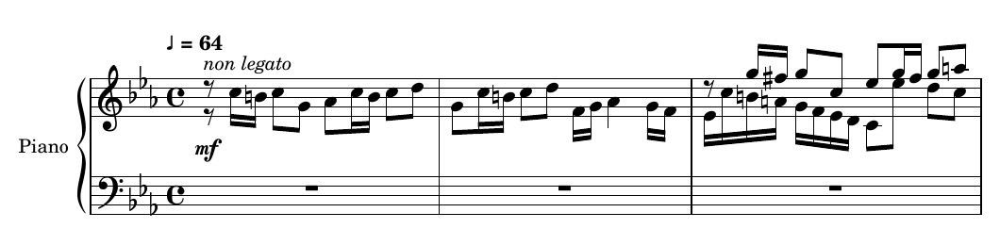

# EtuSchlopf

**Mach aus deiner Einspielung Klaviernoten. Zwei Dateien genügen.**

EtuSchlopf ist für Musikerinnen und Musiker. Ob Etüde, Song oder eigene Komposition, spielt dabei keine Rolle.

- `Mein Stück.mid` liefert die gespielten Noten und ihr Timing.
- `Mein Stück.wav` enthält den hörbaren Klang derselben Einspielung und dient als Audioreferenz.

Leg beide Dateien in denselben Ordner und zieh die MIDI-Datei auf EtuSchlopf. **Das war’s.** EtuSchlopf verwendet seine Voreinstellungen. Du bekommst ein PDF zum Lesen, Teilen und Ausdrucken und eine MusicXML-Datei zum Weiterbearbeiten in MuseScore.

Der Name darf dich zum Schmunzeln bringen. Die Mathematik dahinter nehmen wir ernst. Probier EtuSchlopf mit deinem eigenen Stück aus oder schau dir an, wie es arbeitet. [Die Mathematik hinter EtuSchlopf](docs/MATHEMATIK.md)

**[Windows-EXE herunterladen · Testversion r1749](https://github.com/Funcry241/EtuSchlopf/releases/download/v0.10.1839-r1749-windows-preview/EtuSchlopf-Windows-x64.exe)** · [Vorherige Testversion r1740](https://github.com/Funcry241/EtuSchlopf/releases/tag/v0.10.1839-r1740-windows-preview)

Windows x64 · kein Rust oder Cargo erforderlich · MuseScore für PDF · MIDI und WAV als Eingabe

Der Quellstand auf `main` ist **r1749**. Die [native Windows-Abnahme für BWV 847](docs/evidence/r1749/README.md) dokumentiert Build, Tests und Notensatz.

[Versionshinweise und Prüfsumme](https://github.com/Funcry241/EtuSchlopf/releases/tag/v0.10.1839-r1749-windows-preview) ·
[Erstes Stück](#dein-erstes-stück) · [Grenzen der Testversion](#aktueller-stand) ·
[Technische Dokumentation](docs/DEVELOPMENT.md) · [Mathematik dahinter](docs/MATHEMATIK.md)

> **In English:** EtuSchlopf turns a matching MIDI and WAV pair into piano sheet music: a PDF and a MusicXML file for further editing in MuseScore. The Windows x64 preview needs no installation besides [MuseScore](https://musescore.org/download) for the PDF. The documentation is in German; bug reports and questions in English are welcome.

## Ein Blick auf die Noten

*Johann Sebastian Bach, Fuge c-Moll BWV 847, aus dem nativen Windows-Lauf von r1749. Das Bild öffnet die vollständige vierseitige PDF.*

Das Projekt ist experimentell und privat gepflegt. Prüfe am eigenen Stück,
ob dir die Fassung bei der weiteren Arbeit hilft. Musikalische Nachbearbeitung
kann erforderlich sein.

## Dein erstes Stück

**[Kleines Startbeispiel herunterladen](https://github.com/Funcry241/EtuSchlopf/releases/download/v0.10.1839-r1749-windows-preview/EtuSchlopf-Beispiel-r1749.zip)** – synthetisches MIDI/WAV-Paar mit der PDF, die die veröffentlichte r1749-EXE daraus erzeugt hat.

1. Lade die Windows-EXE herunter. Für die PDF-Ausgabe brauchst du außerdem **[MuseScore](https://musescore.org/de/download)**.
2. Lege MIDI und WAV in denselben Ordner. Die Namen vor der Dateiendung müssen übereinstimmen: `Mein Stück.mid` und `Mein Stück.wav`.
3. Ziehe deine `.mid`- oder `.midi`-Datei auf die EXE. Alternativ startest du die EXE und gibst den Pfad zur MIDI-Datei ein.
4. Öffne nach erfolgreichem Lauf die PDF im angezeigten Ergebnisordner. Zum Weiterbearbeiten öffnest du die Datei mit `.render.musicxml` in MuseScore.

Du brauchst für diesen Weg keinen Repository-Download und keine Rust-Installation.
Wähle für den ersten Versuch ein kurzes Stück, dessen Noten du kennst. So kannst
du das Ergebnis leichter beurteilen.

Neben deiner MIDI entsteht der Ordner **`EtuSchlopf-Ergebnisse`**. Jeder Lauf
bekommt darin einen neuen Unterordner. Das Programm arbeitet mit Kopien deiner
Eingaben; Originaldateien und frühere Laufordner bleiben erhalten.

## Deine Ergebnisse

| Du möchtest … | Öffne … |
| --- | --- |
| die Noten lesen oder ausdrucken | `Mein Stück.pdf` |
| die Noten in MuseScore bearbeiten | `Mein Stück.render.musicxml` |
| eine Fehlermeldung genauer nachvollziehen | `Mein Stück.result.txt`, sofern der Lauf einen Bericht erzeugt hat |

Für die Bearbeitung in MuseScore ist die Datei mit **`.render.musicxml`** die
richtige Wahl. Weitere technische Dateien können im Ergebnisordner liegen.

## Wenn der Start nicht klappt

- **WAV fehlt:** Lege eine echte gleichnamige WAV-Datei neben die MIDI. MIDI ohne WAV wird derzeit noch nicht unterstützt.
- **Keine PDF:** Prüfe, ob MuseScore installiert ist. Mit `EtuSchlopf-Windows-x64.exe "Mein Stück.mid" --no-pdf` kannst du nur die Notendateien anfordern.
- **Datei wird abgelehnt:** Das kann an einer Grenze oder einem Fehler von EtuSchlopf liegen und bedeutet nicht automatisch, dass deine MIDI fehlerhaft ist. Du musst die Ursache nicht selbst herausfinden. Den Wortlaut der Meldung kannst du im [Fehlerbericht](https://github.com/Funcry241/EtuSchlopf/issues/new?template=01_fehler.md) angeben.
- **Lauf fehlgeschlagen:** Frühere Ergebnisordner bleiben bestehen. Eine Datei aus einem fehlgeschlagenen Lauf ist noch kein freigegebenes Ergebnis.

## Eine falsche Note oder einen Fehler melden

**[Fehlerbericht öffnen](https://github.com/Funcry241/EtuSchlopf/issues/new?template=01_fehler.md)**

Beschreibe, was du versucht hast und was passiert ist. Bei einem Notationsfehler
hilft zum Beispiel: „In Takt … fehlt …; ich erwarte …“ Ein Bildausschnitt ist
willkommen. Du musst dafür keinen Quellcode verstehen und keinen vollständigen
Laufbericht zusammentragen. Unbekannte technische Angaben kannst du offenlassen.

## Aktueller Stand

Die Windows-Testversion enthält **Engine r1749 / 0.10.1839** und den
eigenständigen Windows-Starter. Unterstützt sind 2/4, 3/4 und 4/4 sowie
Taktwechsel an Taktgrenzen. Andere Taktarten, Triolen und Wechsel mitten
im Takt bleiben offen.

Der Paketlauf prüft den isolierten Start ohne Entwickler-PATH und rendert
das synthetische MIDI/WAV-Startbeispiel mit MuseScore. Die
[Versionshinweise und Prüfsummen](https://github.com/Funcry241/EtuSchlopf/releases/tag/v0.10.1839-r1749-windows-preview)
verlinken den Paketlauf. Die native musikalische Abnahme dokumentiert
BWV 847. Prüfe Lesbarkeit und Spielbarkeit am eigenen Stück.

## Quellstand und Beiträge

Der Entwicklungsquellstand ist **r1749 / 0.10.1839**. Im nativen Windows-Lauf für BWV 847 bestanden Build, Strict-Clippy und 3.041 Tests. Vier Tests wurden übersprungen. Der PDF-Export wurde freigegeben. [Native Abnahme r1749](docs/evidence/r1749/README.md). Der vollständige Korpuslauf mit zehn Etüden ist für [r1684](docs/evidence/r1684/README.md) dokumentiert.

Die Download-Engine wurde aus dem angenommenen nativen Stand **r1749** gebaut.
Der [zum geprüften Build gehörende r1749-Quellbaum](https://github.com/Funcry241/EtuSchlopf/releases/download/v0.10.1839-r1749-windows-preview/EtuSchlopf-r1749-source.zip)
und das Dateiprüfsummen-Manifest stehen beim Release bereit. Für den exakten
Engine-Build ist dieser Snapshot maßgeblich; der zugehörige Prüfzweig enthält
den Starter und die Skripte zur vollständigen Rekonstruktion und Verifikation.

Für die Arbeit am Quellcode gelten die [technische Referenz](docs/DEVELOPMENT.md)
und die [Beitragsregeln](docs/CONTRIBUTING.md). Der [Dokumentationswegweiser](docs/README.md)
führt zu Architektur, Diagnose und Community-Dateien. Welche Mathematik EtuSchlopf
wo einsetzt und was davon das Notenbild verändert, beschreibt die
[Mathematik-Seite](docs/MATHEMATIK.md).

Fehlerberichte sind willkommen. Bitte nenne die verwendete Version, die konkrete
Meldung und – bei einem Notationsfehler – die betroffene Stelle.
[Beiträge](docs/CONTRIBUTING.md) · [Sicherheit](docs/SECURITY.md) ·
[Umgang miteinander](docs/CODE_OF_CONDUCT.md) · [Barrierefreiheit](docs/ACCESSIBILITY.md)

## Lizenz

Der eigene EtuSchlopf-Code steht unter der [MIT-Lizenz](LICENSE). Für Fremdkomponenten gelten die jeweiligen Lizenzbedingungen. Die externe Chopin-Referenz (WAV und MIDI) steht unter CC BY 4.0. [Fremdkomponenten, Referenzdaten und Namensnennung](docs/THIRD_PARTY_NOTICES.md).
